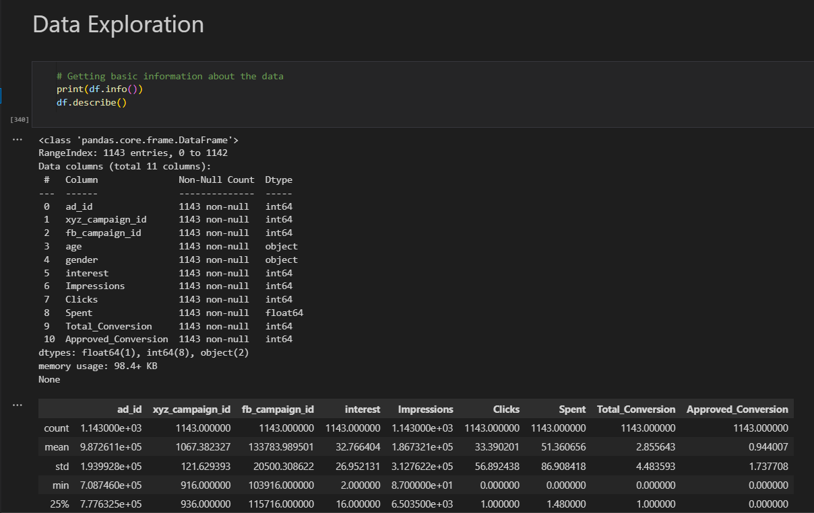
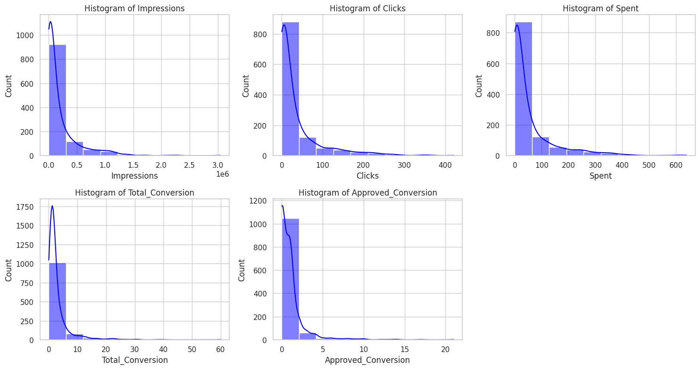
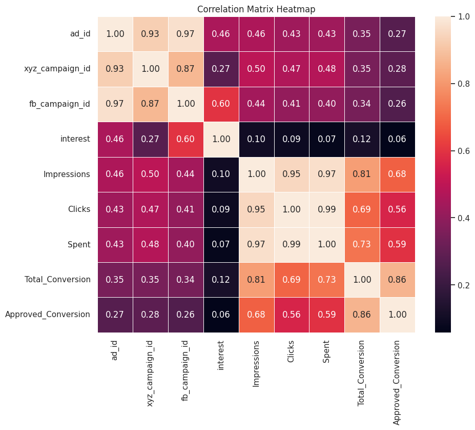
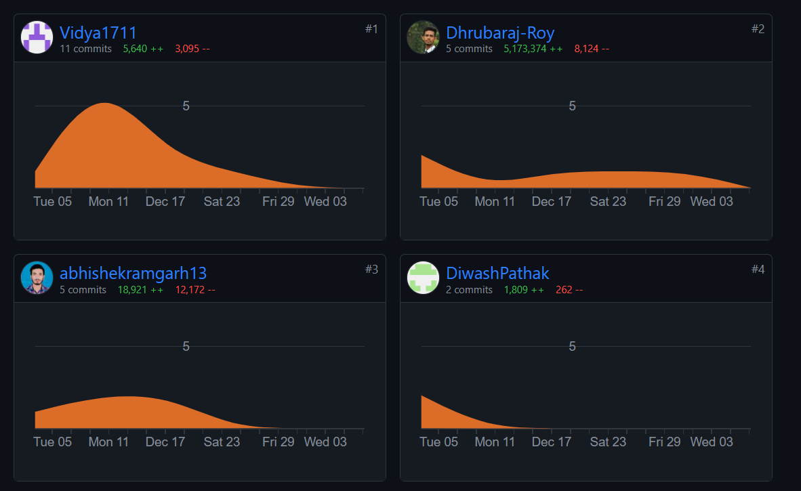
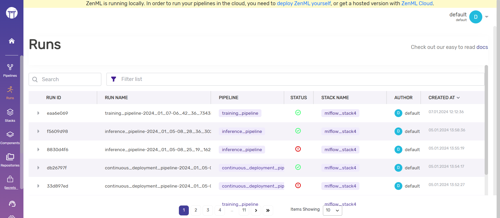
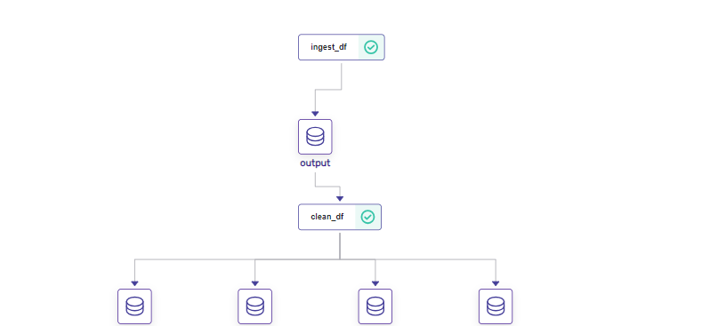
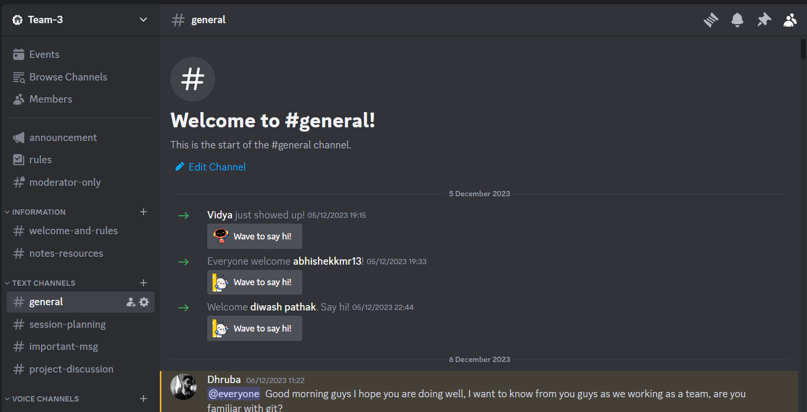

# Sales Conversion Optimization Project

## Project Description

### Overview

The objective of this project was to automate sales conversions for an anonymous organization's social media advertising campaign. The goal is to optimize transformations using a structured pipeline and predictive models.

### 1. Data Exploration and Preprocessing

#### Data Description

The dataset, [conversion_data.csv](https://www.kaggle.com/datasets/loveall/clicks-conversion-tracking/data), includes 1143 observations across 11 variables, detailed as follows:

- ad_id: Unique ID for each ad.
- xyz_campaign_id: ID associated with each ad campaign of XYZ company.
- fb_campaign_id: ID for how Facebook tracks each campaign.
- age: Age of the person to whom the ad is shown.
- gender: Gender of the person to whom the ad is shown.
- interest: Code specifying the category of the person’s interests (based on Facebook profile).
- Impressions: Number of times the ad was shown.
- Clicks: Number of clicks on the ad.
- Spent: Amount paid by company XYZ to Facebook for the ad.
- Total conversion: Total number of inquiries about the product after seeing the ad.
- Approved conversion: Total number of product purchases after seeing the ad.
](images/DE.png)


#### Data Cleaning and Preprocessing

Cleaned and preprocessed the dataset for analysis, identifying and handling missing or inconsistent data. 
However the data contanin 0 duplicate value. Then we checked the outliears 
](images/outL.png)

Used the Facade design pattern for data preprocessing:
We used our favorite design pattern to match the coding style of our teammate and the pattern is the Facade design pattern.
```python
# Facade design pattern for data preprocessing
class DataPreProcessStrategy(DataStrategy):
    # ... (Code snippet provided in the document)

class DataDivideStrategy(DataStrategy):
    # ... (Code snippet provided in the document)

class DataCleaning:
    # ... (Code snippet provided in the document)
```

### 2. Exploratory Data Analysis (EDA)

Performed statistical analysis to understand distributions and relationships, visualized key metrics, and trends in the data. Various exploratory data analysis techniques were employed, including Box plot, Pair plot, and Correlation Matrix heatmap.
](images/BOx.png)
](images/PAIR.png)
](images/HEAT.png)


### 3. Feature Engineering

Implemented feature engineering to create new features that might improve model performance.

### 4. Model Development

Developed machine learning models, including GradientBoostingModel, LinearRegressionModel, AdaBoostRegressorModel, RandomForestRegressorModel, and planned to add more models over time. Evaluated model performance using metrics like R2 Score, RMSE, etc.

### 5. MLOps Integration
#### Version Control and Collaboration

##### Git and GitHub Integration

We have implemented a robust version control system for our code and data using Git and GitHub. Git facilitates version control, allowing multiple team members to work on the project simultaneously. It effectively tracks changes, making it easy to revert to previous versions if needed. GitHub, serving as a centralized platform, enables seamless collaboration, allowing team members to push, pull, and merge changes. This ensures everyone is consistently working with the latest codebase.

](images/git.png)
](images/git2.png)

The utilization of Git and GitHub not only streamlines collaboration but also enhances version control, providing a centralized platform for project management. This approach ultimately improves the efficiency and organization of our team projects.

### Automated Model Training and Deployment

In our project, we've automated the model development process by leveraging ZenML and MLflow for efficient training and deployment pipelines. ZenML assists in organizing and managing machine learning workflows, simplifying the tracking and reproduction of experiments. MLflow automates model training and deployment steps, ensuring a seamless and efficient pipeline.

This setup allows us to experiment with different models, track their performance, and effortlessly deploy the best-performing ones. The integration of ZenML and MLflow has significantly simplified our workflow, making it more manageable and reproducible for future iterations of our project.

#### ZenML Dashboard and Visualizer

Here you can view all our runs in the ZenML Dashboard, providing comprehensive insights into the progression of experiments.

](images/runs.png)

The DAG Visualizer in ZenML offers a clear and visual representation of the workflow, aiding in understanding the dependencies and sequence of tasks.

](images/1.png)
](images/2.png)
](images/3.png)

#### MLflow Artifacts

The artifacts of our MLflow models are accessible, showcasing key components and details associated with each model.
](images/MLflow.png)
For effective communication within our team, we rely on Discord as our primary platform, allowing seamless and real-time interaction. 


](images/Discord.png)
Notion serves as our go-to tool for creating a structured timeline and tracking various project-related tasks. In our four-member team, each member plays a crucial role. 

](images/Role.png)
](images/Timeline.png)

This combination of Discord for communication and Notion for project organization ensured a smooth collaborative environment, keeping everyone informed and organized throughout the development process.
## Streamlit Integration

For our project, we've integrated Streamlit, a powerful Python library, to enhance the user experience in predicting model outcomes. Streamlit simplifies the process of turning data scripts into shareable web applications. With its user-friendly interface and rapid prototyping capabilities, we've created an interactive and intuitive app that allows users to easily input data and obtain predictions from our machine learning models. This integration adds a user-friendly layer to our project, making it accessible to both technical and non-technical stakeholders.
](images/image.png)